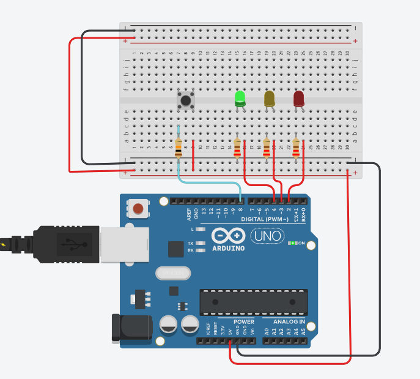
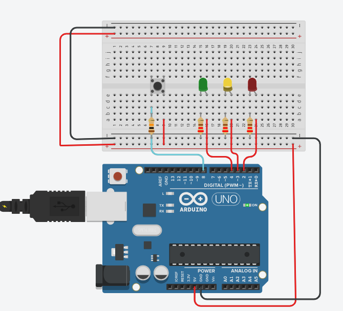
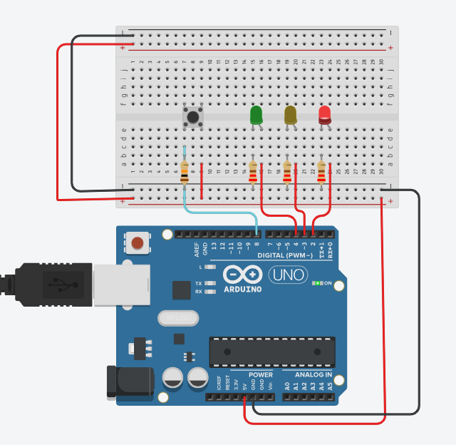

# Botão Semafórico 🚦

## OBJETIVO

O objetivo do projeto é ter um semáforo com os seguintes funcionamentos:

- O LED verde começa aceso.
- Quando o botão é pressionado, o semáforo simula uma mudança de sinal:
  1. O verde apaga e o amarelo acende por 1 segundo.
  2. O amarelo apaga e o vermelho acende por 3 segundos.
  3. O vermelho apaga e o verde acende novamente.

---

## BOM (Bill of Materials)

- 1 LED Vermelho
- 1 LED Amarelo
- 1 LED Verde
- 1 Botão
- 1 Arduino UNO
- 3 Resistores 220Ω
- 1 Resistor 10kΩ

---

## PASSOS

### Código C++

```cpp
int valorBotao;

void setup()
{
  pinMode(8, INPUT);    // Botão
  pinMode(4, OUTPUT);   // Verde
  pinMode(3, OUTPUT);   // Amarelo
  pinMode(2, OUTPUT);   // Vermelho
}

void loop(){
  digitalWrite(4, HIGH);
  valorBotao = digitalRead(8);
  if (valorBotao == 1){
    digitalWrite(4, 0);
    digitalWrite(3, 1);
    delay(1000);
    digitalWrite(3,0);
    digitalWrite(2, 1);
    delay(3000);
    digitalWrite(2, 0);
  }
}
```

---

## Imagens

### Protoboard



*LED Verde inicia aceso*

```cpp
digitalWrite(4, HIGH);
```

Essa parte representa o LED Verde ligado com o código já em funcionamento.

---

### LED Amarelo



*Pressionando o botão, o LED Amarelo acende e o LED Verde apaga*

```cpp
 valorBotao = digitalRead(8);
  if (valorBotao == 1){
    digitalWrite(4, 0);
    digitalWrite(3, 1);
    delay(1000);
```

Aqui representamos a partir do momento em que o botão é pressionado, assim o 'valorBotao' recebe o INPUT e começa a valer 1. Então, entramos na estrutura if, tornando o LED Verde 0, apagando-o e logo em seguida o LED Amarelo se tornando 1 ficando aceso por 1000 milisegundos / 1 segundo.

---

### LED Vermelho 


*Depois o tempo de 1 segundo o LED Vermelho entra em acionamento*

```cpp
    digitalWrite(3,0);
    digitalWrite(2, 1);
    delay(3000);
```

Após a contagem de 1 segundo o LED Amarelo se apaga e logo liga o LED Vermelho tendo um tempo aceso de 3000 milisegundos / 3 segundos.

---

### Estado Natural


*Após os 3 segundos o LED Verde volta ao seu estado natural, permanecedo ligado.*

```cpp
digitalWrite(2, 0);
  }
}
```

Aqui seria a último passo do nosso loop. Desligando o LED Vermelho. Por esse código funcionar em um loop infinito, a execução volta para o topo.

```cpp
void loop(){
  digitalWrite(4, HIGH);
```

Ligando o LED Verde e mantendo até o proximo pressionar do botão.

---

###### Muito obrigado! 
######  &copy; 2025 - Gabriel Theodoro & Ior Soares
